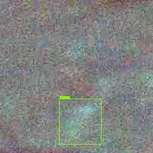

# CHIPathy

Diabetic Retinopathy Detection using PatchCNN Networks.

## CHIPathyDB - The Retinopathy Detection Database

### Steps to Re-produce the Train/Test Dataset
> Since the available data is highly limited and contains segmentation masks, we convert those to bounding boxes for detection and localization.

1. Download diabetic retinopathy dataset from either of these databases:
    - https://idrid.grand-challenge.org/
    - http://www2.it.lut.fi/project/imageret/diaretdb1/
    
2. Pre-processed image using Gray Scale Cropping and Weighted Gaussian Blur. To reproduce the results, run ```dataprep/preprocess_cropnblur.py``` file.
3. Divide the masks and images into patches of size 64x64, run ```dataprep/patches.py``` to get the results.
4. Convert the segmentation masks to bounding boxes. To obtain the results run ```dataprep/masks2boxes.py``` file.
5. Convert these bounding boxes to different formats as required by the model using specific conversion scripts. e.g., for YOLO use ```dataprep/prepdata_yolo.py``` file.
6. To prepare the data (along with annotations) for EfficientDet, run the file ```dataprep/prepdata_coco.py``` since the data is fed into EfficientDet in coco's format. This will prepare the necessary ```.json``` files required to train the network.
7. In case some model requires VOC annotations, use [coco2voc converter][3].


## EfficientDet

### Training

To train the efficientdet, follow the training code provided here: [EfficientDet Repo][1]. The prepared dataset config is given in the efficientdet folder as a ```.yaml``` file.
The dataset config yaml can be accessed from this path: ```efficientdet/images.yaml```

To know the entire training command with params, run help on the train.py as follows.
```
python train.py -h 
```

### Inference

The trained network weights of model d0 can be downloaded for iDRiD dataset from [HERE][2]

To run the inference, run the following command:
```
python efficientdet/efficientdet_test.py <path_to_img> <path_to_trained_weights>
```

### Results

<table style="width:100%">
  <tr>
    <th>Results</th>
    <th>Mask</th>
  </tr>
  <tr>
    <td></td>
     <td></td>
  </tr>
</table>


<!-- Links -->
[1]: https://github.com/zylo117/Yet-Another-EfficientDet-Pytorch
[2]: https://drive.google.com/file/d/1T12drFxe0-r_TxhThFxI3vKgJh4MaTqN/view?usp=sharing
[3]: https://github.com/alicranck/coco2voc